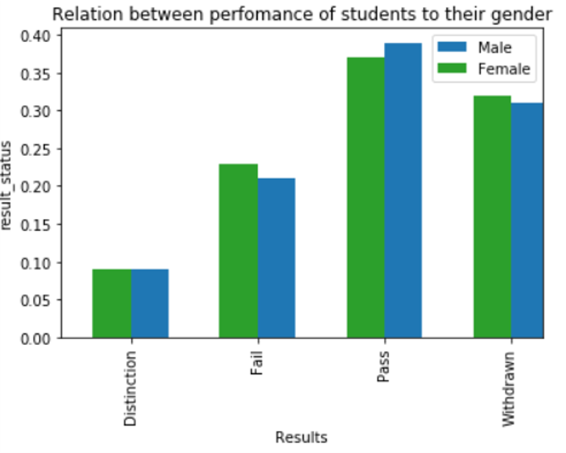
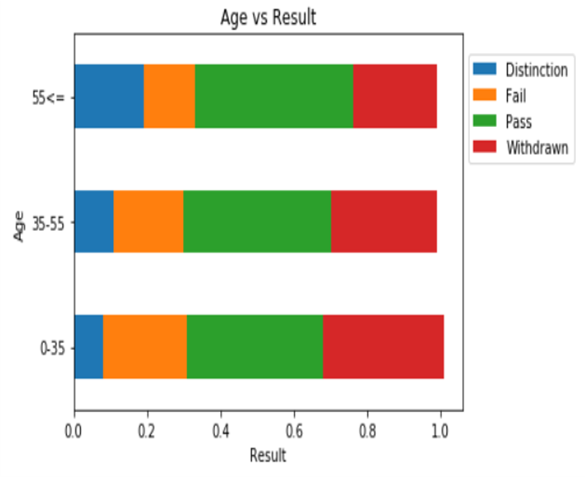
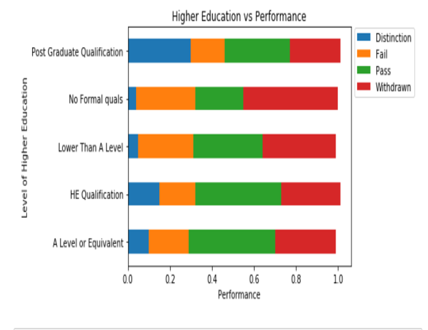

# Student-recommender-system :blue_book:
# Introduction 
  With online classes now becoming more prominent than ever teachers will or have a hard time evaluating and understanding their students thereby focus on those  students who more need attention and direction.
  This project tries to explore ways to automate the process of assessing previous exam performance and predict if a student will drop the course or needs special attention or not. 
  - <h2> NOTE</h2> We have made a dashboard for better understanding of the results  click the link provided 👇.
   * [Check out the Dashboard for better results](https://student-recommender-dashboard.herokuapp.com/)
   * If you want to contribute check 👉[Contribute file](https://github.com/herkura/student-recommender-system/blob/master/Contribute.md).

# Objective
   With the project fully up and running the aim is as follows:
   * Feed-in every student’s performance and train module to analyze the data.
   * Get predictions on how the students will perform in upcoming tests.
   * Can predict if students will drop the course(if they fail/low performance) also help faculty to focus on weak students and present it visually.
   
# Proposed work 
  * The Predictive and Recommendation part of the project is the only module that remains to be fully implemented.
  * Currently the many methods to build initial models are being explored and based on their accuracies and the needs of the module, the  best  model will be implemented.
  * UI (web-based or standalone) needs to be developed that will integrate all functionalities in one place.

# Application and future scope
  * Using proposed work , we can use the system in classes to automate particular tasks such as making performance index of students, pass/fail prediction etc.
  * The teachers just need to feed student data in the specified format and then the module automatically clean, and visualize existing data to provide insights the particular class’ performance.
  * The module will then be able to build a test module and then give out the required recommendations on required parameters.

# Process and Methodology
  

# Results
 * Relationship between performance of the students to their gender.
   

 * Age vs Result
   

 * Higher education vs Perfromance
   

  
    

